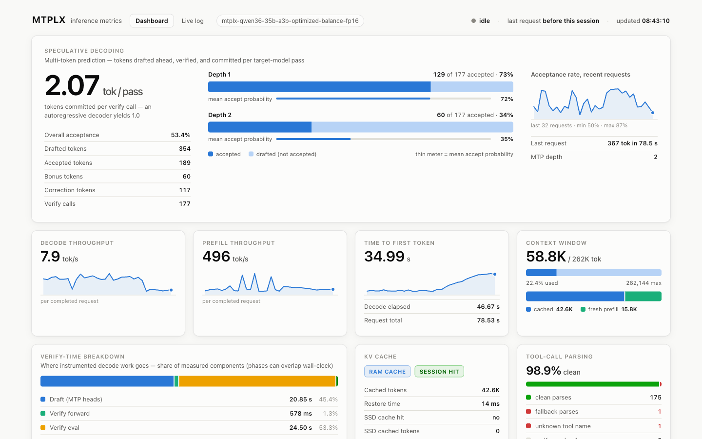
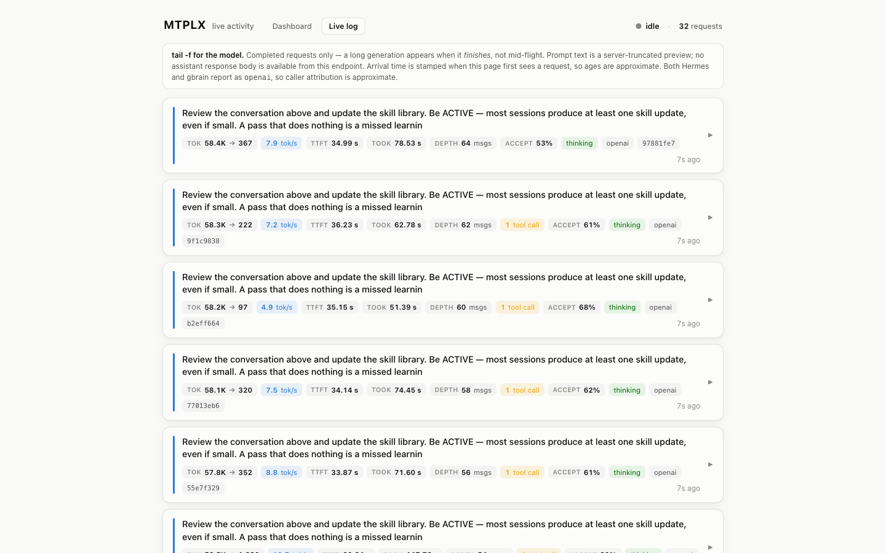

# MTPLX Dashboard

A beautiful realtime dashboard and live activity log for a local
[MTPLX](https://mtplx.com) inference server. A small Node/TypeScript server polls MTPLX's
`/metrics` endpoint itself and pushes updates to the browser over Server-Sent Events — the two
pages (`public/index.html`, `public/log.html`) stay plain HTML/CSS/JS, no client framework, no
build step for the frontend.

[](./LICENSE)

> **What it's for:** MTPLX runs LLMs on Apple Silicon using **MTP (multi-token-prediction)
> speculative decoding**. Its server exposes a rich `/metrics` endpoint — this project turns
> that into (1) a dashboard that tells the *speculative-decoding* story at a glance, and
> (2) a "tail -f for the model" live log of what's being generated right now.

### Dashboard


### Live activity log


---

## Two pages

### `index.html` — Metrics dashboard
The hero is **speculative decoding**: tokens committed per verify pass (an autoregressive
decoder yields 1.0), accepted-vs-drafted per depth, and acceptance probability — the numbers
that explain *why* MTP is fast. Around it:

- **Decode & prefill throughput** (tok/s) with live sparklines
- **Time to first token**
- **Context window** usage with a cached-vs-fresh-prefill split
- **Verify-time breakdown** — where decode time actually goes
- **KV cache** (RAM/SSD source + hit) and **tool-call parse health**

### `log.html` — Live activity log
One row per completed request, newest first:

- **Headline:** the prompt (server-truncated preview)
- **Chips:** tokens in→out · decode tok/s · TTFT · elapsed · conversation depth ·
  tool-calls made · acceptance % · reasoning/thinking flag · client · short request id · live "Ns ago"
- **Click any row** to expand a full detail drawer: every timing/token field, per-depth
  acceptance bars, the conversation role sequence, and available tools.

The two pages cross-link via a header nav.

---

## Quick start

You need a running MTPLX server with its OpenAI-compatible endpoint (and `/metrics`) on
`http://127.0.0.1:8000` — the default target this server polls.

```bash
git clone https://github.com/devty/mtplx-dashboard.git
cd mtplx-dashboard
npm install
npm run dev
# then open:
#   http://127.0.0.1:8123/          → dashboard
#   http://127.0.0.1:8123/log.html  → live log
```

`npm run dev` runs the TypeScript server directly (via `tsx watch`, auto-restarting on change) —
no separate compile step needed for day-to-day development. For production, build once and run
the compiled output:

```bash
npm run build
npm start
```

### Configuration

The server polls a single, configured MTPLX target — set these as environment variables
(`.env.example` documents the same list; this project has no `dotenv` dependency, so either
`export` them in your shell, pass them inline, or use Node's native `--env-file=.env` flag):

| Variable            | Default                  | Meaning                                            |
|---------------------|---------------------------|-----------------------------------------------------|
| `MTPLX_URL`         | `http://127.0.0.1:8000`   | MTPLX server this process polls                     |
| `PORT`              | `8123`                    | Port this dashboard server listens on               |
| `POLL_INTERVAL_MS`  | `1000`                    | How often to poll MTPLX's `/metrics`                |
| `MTPLX_TIMEOUT_MS`  | `2500`                    | Timeout per poll request                            |
| `RING_SIZE`         | `120`                     | Sparkline history depth (dashboard)                 |
| `LOG_BUFFER_SIZE`   | `300`                     | Live-log rolling buffer depth                        |
| `MAX_BACKOFF_MS`    | `10000`                   | Ceiling for poll-retry backoff when MTPLX is down    |

```bash
MTPLX_URL=http://box.local:8000 npm run dev
```

---

## How it works

- A Node/TypeScript server (`server/`) polls `GET {MTPLX_URL}/metrics` on an interval, server-side
  — not the browser. The response is `{ latest, recent[32], tool_parse_counters }` — `latest` is
  the most recent request, `recent` is MTPLX's own rolling 32-deep history.
- The server keeps its own deeper in-memory history (sparkline ring buffers sized `RING_SIZE`,
  a live-log buffer sized `LOG_BUFFER_SIZE`, deduped by `request_id`) and retries with exponential
  backoff (capped at `MAX_BACKOFF_MS`) when MTPLX is unreachable.
- Browsers connect once via `EventSource` to `/api/events`: an initial `snapshot` event delivers
  full history immediately (a reload or a brand-new tab never starts from empty), and a `tick`
  event pushes out on every genuine change thereafter — no client-side polling.
- Sparklines are still hand-drawn inline SVG on the client; only *where the history comes from*
  changed (the server, not a per-tab ring buffer).
- Because polling happens server-to-server, MTPLX's CORS reflection is no longer relevant — the
  browser only ever talks same-origin to this Node server.
- Both pages are light/dark aware (`prefers-color-scheme`) and degrade gracefully when MTPLX is
  unreachable (dim + reconnect banner, last values retained) or when the SSE connection itself
  drops (native `EventSource` auto-reconnect, no custom retry logic needed).

## Limitations (by design — it reads `/metrics`, nothing more)

- **Completed requests only.** A long generation appears when it *finishes*, not mid-flight.
- **Prompt is a server-truncated preview**, and there is **no assistant response body** in
  `/metrics` — this is a live pulse, not a full trace store.
- **Caller attribution is approximate.** OpenAI-compatible clients report the same
  `client_label`, so multiple apps hitting one server aren't cleanly distinguished.
- For full prompt/response bodies and tool-call arguments, you'd put a logging proxy in front
  of the server — out of scope here.

---

## License

[MIT](./LICENSE) © 2026 Tyler Singletary

Not affiliated with or endorsed by MTPLX — a community tool built against its public
`/metrics` endpoint.
